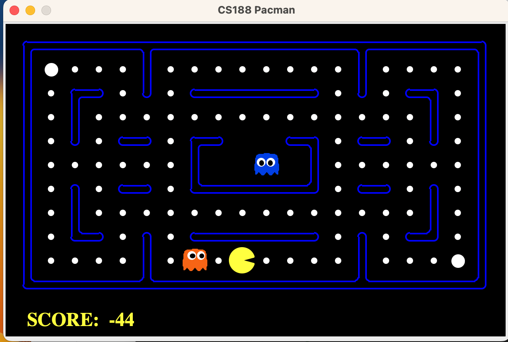

# AI-for-Pacman
Project for constructing different AI algorithms to control pygame Pacman


## Create a virtual environment
Run in the terminal:
```
git clone https://github.com/Baltsat/AI-for-Pacman; 
virtualenv venv; 
source venv/bin/activate; 
pip3 install -r requirements_AIC.txt;
cd search_AIC;
```

## Execute

- To run a UI
```python
python3 pacman_AIC.py
```

- To run a simple agent
```python
python3 pacman_AIC.py --layout testMaze --pacman GoWestAgent
```

You should have in the terminal:

| Pacman emerges victorious! | Score: 503     |
|---------------------------|----------------|
| Average Score             | 503.0          |
| Scores                    | 503.0          |
| Win Rate                  | 1/1 (1.00)     |
| Record                    | Win            |





